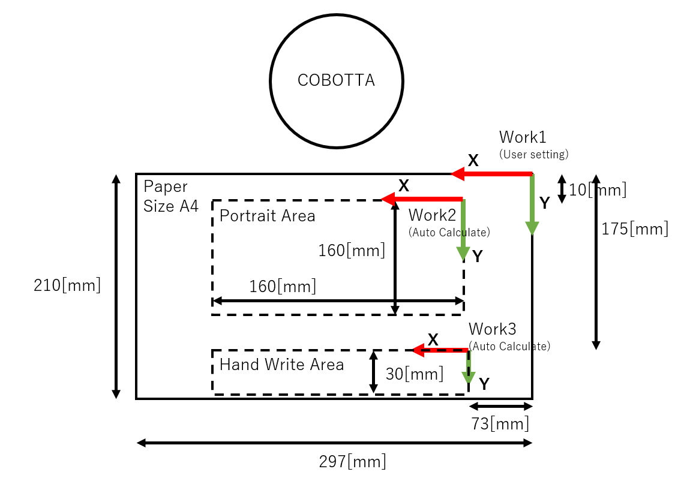
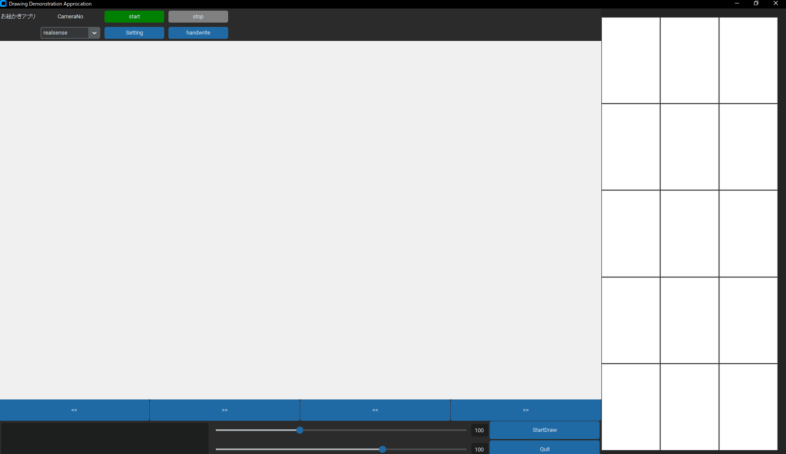
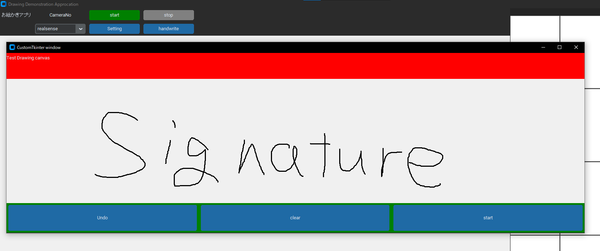

# Drawing demo Apprication

This application takes a picture of a person's face with a camera and draws a portrait using a Denso robot.

There is a function that allows a person to write letters on the application screen and the robot writes the letters directly on the paper.

It is assumed that COBOTTA is used.

This application can be used at exhibitions and events.

この Readme は編集中です。

# DEMO

demostration gif

# Features

The camera detects people and draws their portraits with the robot.
By working with COBOTTA, the robot can work in the same space as a person.


# Requirement

Using libraries

- customtkinter >= 5.2.0
- numpy
- opencv-python
- Pillow

# Installation

install python libraries

```bash
pip install customtkinter 
pip install pillow
pip install opencv-python
pip install numpy
```

```bash
pip install customtkinter pillow opencv-python numpy
```

Download the haarcascades file and save it in the `drawing_demo_app\source` .

The application uses `haarcascade_frontalface_default.xml` and `haarcascade_eye.xml`.

save the file  `drawing_demo_app\source\haarcascades\haarcascade_frontalface_default.xml` and `drawing_demo_app\source\haarcascades\haarcascade_eye.xml` .

haarcascades files : https://github.com/opencv/opencv/tree/master/data/haarcascades

# Usage

## COBOTTA settings

### Setting Tool1

Set the pen tip position in Tool1.

### Setting Work1

Set the corner of the paper on which the portrait is to be drawn in Work 1.

### Setting Work2

Set the corner where you want to write the handwritten text.

### Layout



## setting program

```bash
git clone https://github.com/hoge/~
cd drawing_demo_app/source
```

Please change the contents of conf according to your environment.

conf: drawing_demo_app/conf/conf.json

## Start Apprication

```bash
python drawing_demo_app.py
```




## Start take photos


### select camera

Select the camera from Realsence or USB camera. For USB cameras, select the recognized ID number.

### Start taking photos.

Start taking photos by pressing the Start button.

## select portrait

Stop taking photos by pressing the Stop button.

Select a photo to draw a portrait from among the photos taken with the ">>" button or "<<" button below the photo.

## start draing

Click the "Start Draw" button at the bottom of the window to start COBOTTA running and drawing the portrait.

## Hand write sign

You can have COBOTTA sign your signature by writing your handwritten signature in the window.

Signwindow" is displayed by pressing the "handwrite" button.

In the white area of the "Signwindow" you can write your signature.

Press the "start" button and COBOTTA will begin to write your signature.




# Note

## Robot motion pose

While the robot is working to draw a line, it moves to the next position and pose `P(X, Y, 0, 180, 0, 180, 261)`. 
X,Y are values that change with the line coordinates.

Set the height and direction of the `work1` and `work2` coordinate to work well.

## Initial Position

The initial and reference positions are set to J(0,0,90,0,0,90,0).


# Future

- There is a bug that causes the application to close abruptly. I will fix it.
- Portrait style can be changed by to use "stable diffusion" or similar services.


# Author

- Shohei Kobata 
- DENSO WAVE INCORPORATED
- shohei.kobata.j7p@denso-wave.com


# License

"Drawing demo Apprication" is under [MIT license](https://en.wikipedia.org/wiki/MIT_License).
